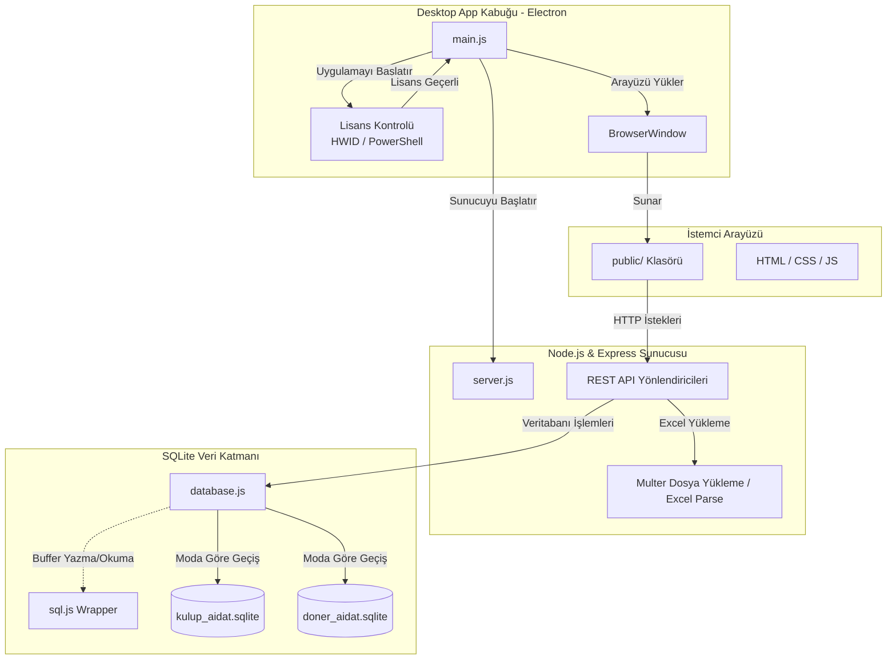

# Aidat Takip Programı - Mimari Harita

Bu doküman `kulup_aidat_app` projesinin genel mimari yapısını, temel bileşenlerini ve veri akışını gösterir.

## Genel Mimari Bileşenleri

## 1. Masaüstü Kabuğu (Electron)
- **`main.js`**: Uygulamanın giriş noktasıdır. Electron tabanlıdır.
- **Lisanslama Sistemi**: Kullanıcının donanım kimliğini (`UUID`) alıp basit bir aktivasyon mekanizması uygular. Geçerliyse sunucuyu ve ana pencereyi başlatır.
- **Tarayıcı Penceresi**: Arka planda açılan localhost Express sunucusunu bir Chromium penceresinde gösterir.

## 2. Arka Uç ve API Sunucusu (Node.js & Express)
- **`server.js`**: Backend'in kalbidir. Express.js kullanılarak oluşturulmuştur.
- **API Endpointleri**: `/api/payments`, `/api/students`, `/api/statements`, vb. rotaları içerir.
- **Excel İşleme**: Banka ekstrelerini ve toplu öğrenci kayıtlarını okumak için `multer` ve `xlsx` kütüphaneleriyle yüklenen dosyaları ayrıştırır.

## 3. Veritabanı Katmanı (SQLite)
- **`database.js`**: `sql.js` kütüphanesini sararak (wrapper) veritabanı işlemlerini yönetir. Native `sqlite3` modülü yerine Buffer olarak belleğe alıp diske yazarak (export) çalışır.
- **Çift Mod (Kulüp & Döner Sermaye)**: `mode.txt` dosyası üzerinden okunan değere göre `kulup_aidat.sqlite` veya `doner_aidat.sqlite` dosyalarından birine bağlanır.
- **Tablolar**: 
  - `students`: Öğrenci bilgileri (TC, Ad, Soyad vb.)
  - `payments`: Manuel veya otomatik eklenen ödemeler
  - `statements`: Yüklenen banka dekontları / ekstre dökümleri
  - `settings`: Okul adı, dönemi ve şifre gibi genel yapılandırmalar.

## 4. Ön Yüz (Frontend)
- **`public/` Klasörü**: Geleneksel statik HTML, CSS ve JavaScript (`index.html`) dosyalarını barındırır.
- React veya Vue gibi bir framework yerine doğrudan DOM manipülasyonu yapan Vanilla JS kullanılıyor gibi görünmektedir. Express tarafından `express.static` ile sunulur.

## 5. Başlatıcı ve Yardımcı Betikler
- `baslat.bat`, `KURULUM.bat`, `MASAUSTU_YAP.bat`: Son kullanıcıların Node modüllerini kurması, uygulamayı başlatması ve masaüstü kısayolları oluşturması için yazılmış Windows toplu iş dosyalarıdır.
- `package.json`: İçinde hem normal `node server.js` hem de `electron .` başlatma ve paketleme (`electron-builder`) betiklerini bulundurur.
